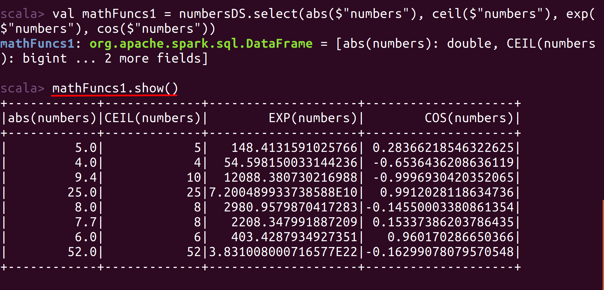
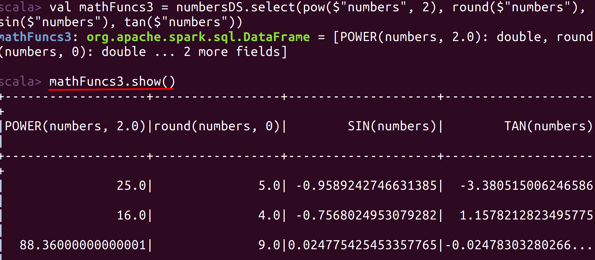
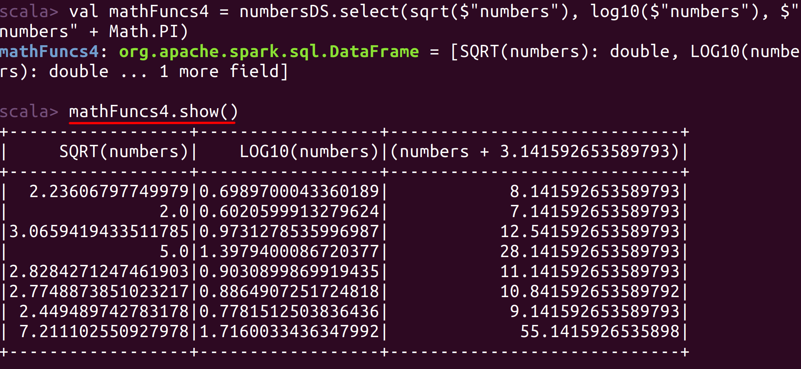
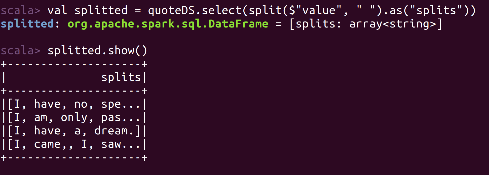
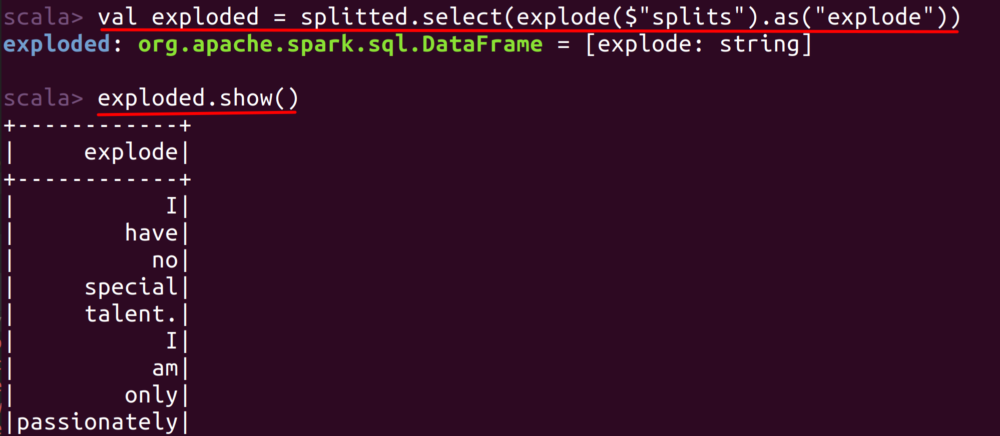
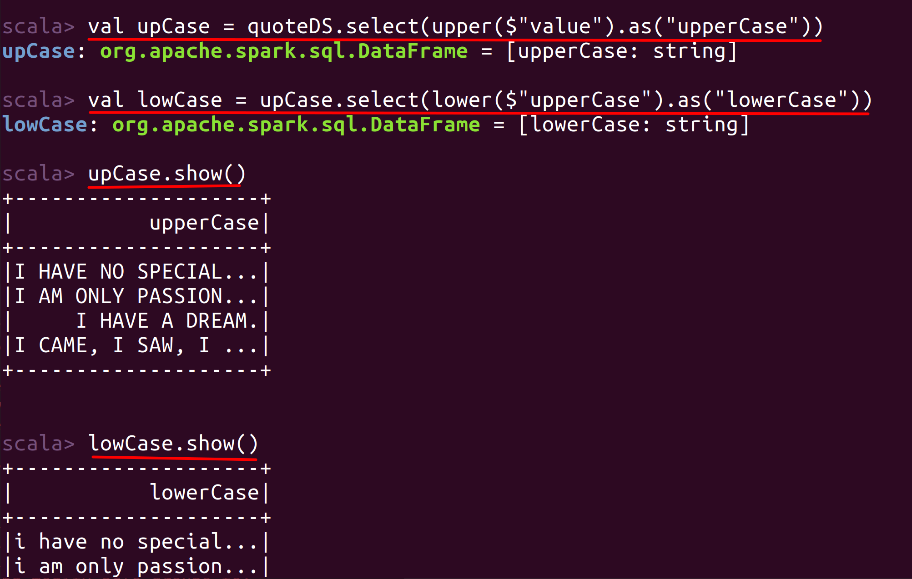
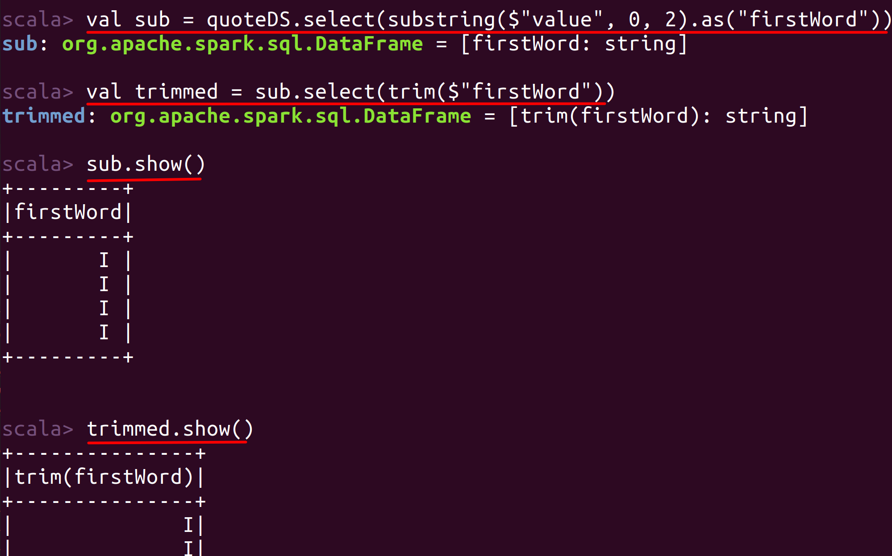

# Lab : Apache Spark Math and String Functions

#### Pre-reqs:
- Google Chrome (Recommended)

#### Lab Environment
All packages have been installed. There is no requirement for any setup.

**Note:** Labs will be accessible at the port given to you by your instructor. Password for jupyterLab : `1234`

Lab instructions and scala examples are present in `~/work/ernesto-spark` folder. To copy and paste: use **Control-C** and to paste inside of a terminal, use **Control-V**

There should be terminal(s) opened already. You can also open New terminal by Clicking `File` > `New` > `Terminal` from the top menu.

Now, move in the directory which contains the scala source code by running following command in the terminal.

`cd ~/work/ernesto-spark`

You can access jupyter lab at `<host-ip>:<port>/lab/workspaces/lab24`

## Prerequisites

We need following packages to perform the lab exercise: 
- Java Development Kit
- pyspark


#### JAVA
Verify the installation with: `java -version` 

You'll see the following output:

```
java version "1.8.0_201"
Java(TM) SE Runtime Environment (build 1.8.0_201-b09)
Java HotSpot(TM) 64-Bit Server VM (build 25.201-b09, mixed mode)
```


## Math Functions

There are a number of math functions which can be applied to columns with numbers. Let us now look at few of them.

Fire up the spark-shell from the terminal `spark-shell`

**Step 1:** Let us first create a collection with data as shown below. Please make sure you have the imports from the previous section already imported. You will have to import them again if you have closed the Spark Session.

`val numbers = List(5, 4, 9.4, 25, 8, 7.7, 6, 52)` 

**Step 2:** Next, let us convert the collection to dataset using the toDS method and rename the column as numbers using the withColumnRenamed method. The default column name when you create a dataset is value. Hence we change the default column name to numbers.

```val numbersDS = numbers.toDS().withColumnRenamed("value", "numbers").cache()
``` 

The dataset should now be created with the renamed column.


**Step 3:** Let us now perform various math functions on the dataset. All these functions are self explanatory.

`val mathFuncs1 = numbersDS.select(abs($"numbers"), ceil($"numbers"), exp($"numbers"), cos($"numbers"))` 

- The abs function returns the absolute value of the number.

- The ceil function returns the number of double type greater than or equal to the nearest rounded integer. 

- The exp function returns Eulers E raised to power of double value.

- The cos function returns the trigonometric cosine of an angle.

Let us check the result using the show method.

`mathFuncs1.show()` 

The following result is shown.




 

**Step 4:** Let us now use some more math functions.

`val mathFuncs2 = numbersDS.select(factorial($"numbers"), floor($"numbers"), hex($"numbers"), log($"numbers"))` 

- The factorial functions returns the factorial of the number.

- The floor function is opposite to the ceil function which returns the number of double type lesser than or equal to the nearest rounded integer.

- The hex function returns a hex value.

- The log function returns the natural logarithm (base e) of a double value as a parameter.

Let us check the result using the show method.

`mathFuncs2.show()` 
 
The following result is shown.




**Step 5:** Let us now use even more math functions.

`val mathFuncs3 = numbersDS.select(pow($"numbers", 2), round($"numbers"), sin($"numbers"), tan($"numbers"))` 

- The pow function returns the number raised to the power of some other number. It takes two arguments. The first argument is the column with numbers and the second argument is number which the power has to be calculated.

- The round function returns the rounded value to its nearest decimal.

- The sin and tan functions return the sine and tangent trignometric angle respectively.

Let us check the result using the show method.
`mathFuncs3.show()` 

The following result is shown.




**Step 6:** Let us finally conclude math functions with a couple more of them.

`val mathFuncs4 = numbersDS.select(sqrt($"numbers"), log10($"numbers"), $"numbers" + Math.PI)` 

- The sqrt function returns the square root of the given numbers in the column.

- The log10 function returns the base 10 logarithm of a double value.

- In the third column, we have simply added the value of PI by using the Math.PI expression.

Let us check the result using the show method.
`mathFuncs4.show()` 


The following result is shown.


## String Functions

There are a plethora of String functions available in Spark. Let us look at few of them now.

**Step 1:** As usual, let us first create the List and create a dataset from it. Please make sure to specify imports again if you have closed the Spark session.

```val quote = List("I have no special talent.",
  "I am only passionately curious.",
  "I have a dream.",
  "I came, I saw, I conquered.")
``` 

`val quoteDS = quote.toDS().cache()` 

Let us use the show method to display the dataset as shown below.

`quoteDS.show()` 


 

**Step 2:** Let us first use the split method to split the strings by space as below.

`val splitted = quoteDS.select(split($"value", " ").as("splits"))`

The split method takes two arguments. The first argument is the name of the column and the second method is the pattern to which the string should be split on.

Let us use the show method to display the dataset as shown below.

`splitted.show()`
 


As you can see from the screenshot above, the rows have now been splitted by whitespace.

**Step 3:** Next, let us use the explode function which we have learned in this exercise to create column for each element in the collection.

`val exploded = splitted.select(explode($"splits").as("explode"))` 

Let us use the show method to display the dataset as shown below.

`exploded.show()`

Now that we have each word as a row, let us apply some string functions.

The first function we use is to find out the length of each word using the length function as shown below.

`val strLen = exploded.select($"explode", length($"explode")).as("length")`

Let us use the show method to display the dataset as shown below.

`strLen.show()`




**Step 4:** Let us now use string functions to convert strings from lower case and upper case.

`val upCase = quoteDS.select(upper($"value").as("upperCase"))`

`val lowCase = upCase.select(lower($"upperCase").as("lowerCase"))`

Let us use the show method to display the datasets as shown below.

```upCase.show()
lowCase.show()
```



**Step 5:** Finally, let us look at  substring and trim functons to extract a part of string and trim the whitespaces before and after the string respectively.

`val sub = quoteDS.select(substring($"value", 0, 2).as("firstWord"))`

`val trimmed = sub.select(trim($"firstWord"))`

Let us use the show method to display the datasets as shown below.

```sub.show()
trimmed.show()
```

The substring function takes three arguments. The first is the column name from which the sub string to be extracted from. Second and third are the start and positions from which we want to extract the string from.



Here we have extracted the first word and space after it using the substring function. Since our fist word is only a letter, we start from 0 position and end at 2nd position which is the whitespace. Next, we use the trim function to trime the whitespaces before and after. Since there are no whitespaces before, the function will simply trim the whitespace after. You can also use rtrim function to trim only the whitespaces at the end and ltrim function to trim only the whitespaces at the beginning.

Task is complete!


