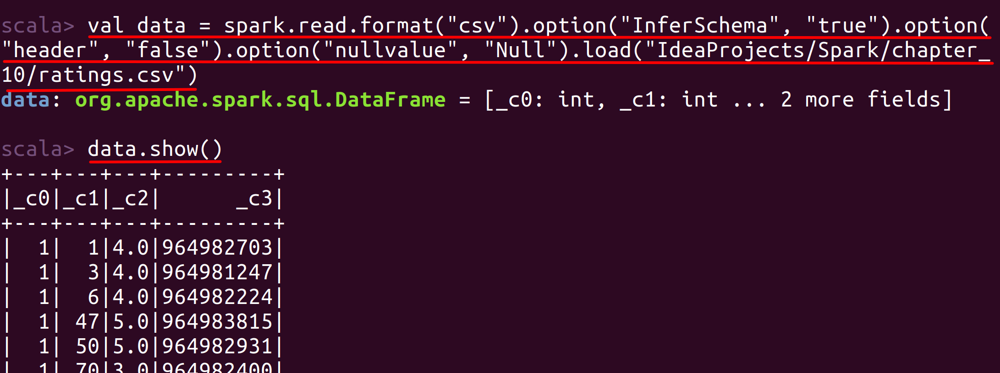
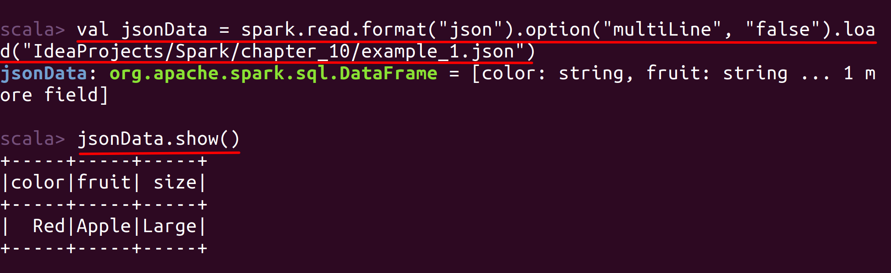

# Lab : Apache Spark File Formats - CSV and JSON

#### Pre-reqs:
- Google Chrome (Recommended)

#### Lab Environment
Notebooks are ready to run. All packages have been installed. There is no requirement for any setup.

**Note:** Elev8ed Notebooks (powered by Jupyter) will be accessible at the port given to you by your instructor. Password for jupyterLab : `1234`

All Notebooks are present in `work/Grokking-Deep-Learning` folder. To copy and paste: use **Control-C** and to paste inside of a terminal, use **Control-V**

You can access jupyter lab at `<host-ip>:<port>/lab/workspaces/lab31`

## Clone Repository

Let's first setup VScode editor and clone repository. Clone the following repository by executing following command in the terminal.
`git clone https://github.com/athertahir/apache-spark.git`{{execute T1}}

- Click **IDE Editor** tab to open Visual Studio and open solution explorer and open `apache-spark/Files/chapter_10` to view files.


The aim of the following lab exercises is to read and write various file formats in Spark applications.
We will cover following topics in this scenario.
- CSV Files
- JSON Files

## Prerequisites

We need following packages to perform the lab exercise: 
- Java Development Kit
- pyspark


#### JAVA
Verify the installation with: `java -version`{{execute T1}} 

You'll see the following output:

```
java version "1.8.0_201"
Java(TM) SE Runtime Environment (build 1.8.0_201-b09)
Java HotSpot(TM) 64-Bit Server VM (build 25.201-b09, mixed mode)
```


#### Install pyspark
PySpark is available in pypi. To install just run `pip install pyspark`{{execute T1}} 

The Python packaging for Spark is not intended to replace all of the other use cases. This Python packaged version of Spark is suitable for interacting with an existing cluster (be it Spark standalone, YARN, or Mesos) - but does not contain the tools required to set up your own standalone Spark cluster.

## CSV Files

Similar to the text files we can also save the CSV files using the DataSource API. Each line in the CSV file represents a single record. CSV contains a large number of options when it comes to processing them. With these options we can efficiently handle tricky scenarios such as corrupt records etc. 

CSV files support compression, are human readable and are splittable. However, CSV files are not nestable and cannot hold complex data structures. The following is an example to read a CSV file.

## Task: CSV Files

Let us now look at reading and writing CSV files to Spark. We have been reading and writing CSV files in the previous chapters. However, let us also see some of many options that can be used while reading and writing CSV files.

**Step 1:** Download the file ratings.csv from the URL below and save it to the /home/jovyan/work/ernesto-spark/Files/chapter_10 folder.

ratings.csv - http://bit.ly/2L8IEBS

**Note:** We already have cloned a github repository which contains a required file. Open `apache-spark/Files/chapter_10` to view file.

Each line of this file represents one rating of one movie by one user, and has the following format: userId, movieId, rating, timestamp

**Step 2:** Let us now read this file to Spark from Spark shell using few options.

Open the terminal and fire up the Spark shell `spark-shell`{{execute T1}}.

Enter into the paste mode and execute the following code.
`:paste`{{execute T1}}

**Note:** After pasting following code in the scala terminal, Press  `Ctrl` + `D` to run code.

```val data = spark
.read
.format("csv")
.option("InferSchema", "true")
.option("header", "false")
.option("nullValue", "Null")
.load("/home/jovyan/work/ernesto-spark/Files/chapter_10/ratings.csv")```{{execute T1}}

We have used a new option here which is called NullValue. This will replace all the null values with the provided string, which is Null in this case. The default is "". Please check the references section for all the options that can be used while reading or writing CSV files. All the options can be used in this way or inside a map object.

We can then call the show method as shown in the screenshot below to check if it was successful.
 
 


**Step 3:** We can also use the modes we have learned in our theory. Let us see an example.

Enter into the paste mode and execute the following code.
`:paste`{{execute T1}}

**Note:** After pasting following code in the scala terminal, Press  `Ctrl` + `D` to run code.

```val dataNew = spark
.read
.format("csv")
.options(Map("InferSchema" -> "true"
, "header" -> "false"
, "nullValue" -> "Null"
, "mode" -> "FAILFAST"))
.load("/home/jovyan/work/ernesto-spark/Files/chapter_10/ratings.csv")```{{execute T1}}


`dataNew.show()`{{execute T1}}


**Step 4:** Let us now write this dataframe back to the filesystem in CSV format.

Enter into the paste mode and execute the following code.
`:paste`{{execute T1}}

**Note:** After pasting following code in the scala terminal, Press  `Ctrl` + `D` to run code.

`dataNew.write.format("csv").option("sep", "|").save("/home/jovyan/work/ernesto-spark/Files/chapter_10/output2")`{{execute T1}}

Here, we have used an option called sep which replaces the delimiter from comma to a pipe.

**Step 5:** Let us check if the save was successful as we desired.

**Important:** 
- Commands below will run in **terminal 2** (It will open automatically on executing command). You can also open it by clicking `+` icon and selecting `new terminal`
- Interface will keep switching back to terminal 1 after executing command, you can manually switch by clicking `terminal 2`.

`cat /home/jovyan/work/ernesto-spark/Files/chapter_10/output2/part*`{{execute T2}}


Task is complete!


## Task: JSON Files 


Similar to previous taks, let us read and write JSON files. We shall be reading two kinds of JSON files. One is a single line JSON and other is the multi line JSON.

JSON is also one of the popular file formats around which stands for JavaScrit Object Notation. JSON is compressable, splittable and human readable. It is also nested and supports complex data structures. With Spark, we can load a single line JSON and also a multi-line JSON. All we need to do is specify an option for multi-line JSON. However, it is recommend to use single line JSON whenever possible.

**Step 1:** Download the file example_1.json from the URL below and save it to the /home/jovyan/work/ernesto-spark/Files/chapter_10 folder.

example_1.json - http://bit.ly/2lRFI06

**Note:** We already have cloned a github repository which contains a required file. Open `apache-spark/Files/chapter_10` to view file.


**Step 2:** The following code is used to read the single line JSON file.

Enter into the paste mode and execute the following code.
`:paste`{{execute T1}}

**Note:** After pasting following code in the scala terminal, Press  `Ctrl` + `D` to run code.

```val jsonData = spark.read
.format("json")
.option("multiLine", "false")
.load("/home/jovyan/work/ernesto-spark/Files/chapter_10/example_1.json")```{{execute T1}}


**Step 3:** Let us check if we were able to load the JSON file successfully.

`jsonData.show()`{{execute T1}}



**Step 4:** Let us now load the multi line JSON file. Download the file example_2.json from the URL below and save it to the /home/jovyan/work/ernesto-spark/Files/chapter_10 folder.

example_2.json - http://bit.ly/2lL3IST

**Note:** We already have cloned a github repository which contains a required file. Open `apache-spark/Files/chapter_10` to view file.


**Step 5:** The following code is used to read the single line JSON file.

Enter into the paste mode and execute the following code.
`:paste`{{execute T1}}

**Note:** After pasting following code in the scala terminal, Press  `Ctrl` + `D` to run code.

```val multiJson = spark.read
    .format("json")
    .option("multiLine", "true")
    .load("/home/jovyan/work/ernesto-spark/Files/chapter_10/example_2.json")```{{execute T1}}


**Step 6:** Let us now write this dataframe to the filsesystem.

`multiJson.write.format("json").save("/home/jovyan/work/ernesto-spark/Files/chapter_10/output3")`{{execute T1}}
 
#### Output
You can check the output by running the following command from a new terminal.

**Important:** 
- Commands below will run in **terminal 2** (It will open automatically on executing command). You can also open it by clicking `+` icon and selecting `new terminal`
- Interface will keep switching back to terminal 1 after executing command, you can manually switch by clicking `terminal 2`.

`cat /home/jovyan/work/ernesto-spark/Files/chapter_10/output3/part*`{{execute T2}}

 
Task is complete!


