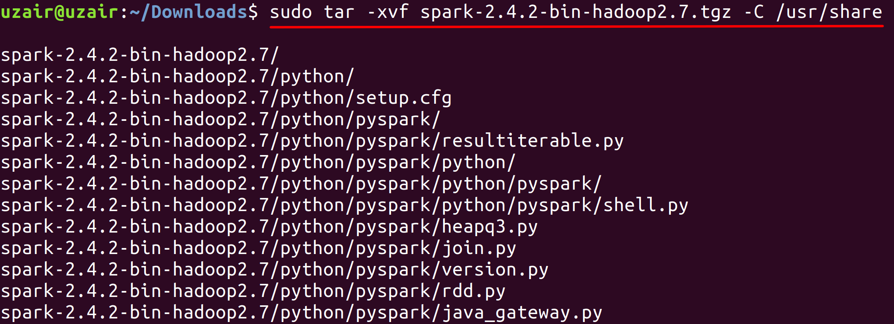

# Lab : Apache Spark Installation

#### Pre-reqs:
- Google Chrome (Recommended)

#### Lab Environment
All packages have been installed. There is no requirement for any setup.

**Note:** Labs will be accessible at the port given to you by your instructor. Password for jupyterLab : `1234`

All Notebooks are present in `~/work/ernesto-spark` folder. To copy and paste: use **Control-C** and to paste inside of a terminal, use **Control-V**

You can access jupyter lab at `<host-ip>:<port>/lab/workspaces/lab4`

## What is Spark?

Apache Spark is an open source, fast and unified parallel large-scale data processing engine. It provides a framework for programming with distributed processing of large datasets at high speed. Spark supports most popular programming languages such as Java, Python, Scala and R. 

Spark is scalable, meaning, it can run on a single desktop machine or a laptop to a cluster of thousands of machines. Spark provides a set of inbuilt libraries which can be accessed to perform data analysis over a large dataset. However, if your requirement doesn’t get satisfied with the inbuilt libraries, you can write one or explore countless external libraries from open source communities on the internet.

## Why Spark?

Why use Spark when we have Hadoop? Well, Spark excels as a unified platform for processing huge data at very high speeds for various data processing requirements (will be discussed later in this chapter). Also, Spark is an in-memory processing framework. Spark is considered as a successor of Apache Hadoop. Let us briefly discuss the advantages of Spark over Hadoop.


#### Data Processing with Spark

In Spark, the data is read from the disk, processed in-memory but instead of spilling it back to disk, Spark can retain the data within the memory for further processing. So, if the processed data is again required for further processing, the data is already present in the memory and the Spark application processes the data eliminating the IO latency and therefore the overall time to process the job is significantly reduced. 


## Install Java


**Step 1:** From the terminal, run the following commands to install JDK (Java Development Kit).

`sudo apt-get update` 

**Step 2:** Once you run the above command, run the following command to actually download and install JDK.

`sudo apt-get --assume-yes install default-jdk` 


**Step 3:** Verify the installation with: `java -version` 

You'll see the following output:

```
java version "1.8.0_201"
Java(TM) SE Runtime Environment (build 1.8.0_201-b09)
Java HotSpot(TM) 64-Bit Server VM (build 25.201-b09, mixed mode)
```

**Note:** Java Development Kit (JDK) is a prerequisite to install Spark.

## Install Spark...


**Step 2:** Let us install Spark in Standalone mode. Navigate to the download URL below, select the latest stable version for Spark (which is Spark 2.4.2 at the time of writing this book) and select the package type which is Pre-built for Apache Hadoop 2.7 and later. After selecting click the link as shown in the screenshot below to download Spark.

Download URL : http://spark.apache.org/downloads.html

`wget https://www-us.apache.org/dist/spark/spark-2.4.4/spark-2.4.4-bin-hadoop2.7.tgz`

After running the above command, your download should start. The download may take a while depending upon your internet connection.

**Step 3:** The download will be saved in the current directory by default. You may optionally check if Spark has been downloaded using the ls command.

`ls`


 

Now that you are sure that you have the Spark tar file, untar the Spark tar file to /usr/share directory using the command below.

`tar -xvf spark-2.4.4-bin-hadoop2.7.tgz -C /usr/share` 
 


The file will start to untar to /usr/share directory as shown in the screenshot above. You can verify the same by executing the following command below.

`cd /usr/share`

`ls sp*`


As we can see from the screenshot above, the Spark directory is listed.


Let us make a softlink to the spark directory so that we don't have to refer Spark with entire name as above. This will also be useful for the future updates. Execute the following command.

`ln -s spark-2.4.4-bin-hadoop2.7/ spark`


Run the following command again to check if we were able to create the softlink successfully.

`ls sp*`
 
 ## Environment Variables

**Step 4:** Let us now set up the environment variables for Spark. Execute the following command to do so.

Run following commands to append the environment variable at the end of the file.

`echo "SPARK_HOME=/usr/share/spark" >> ~/.bashrc`

`echo "PATH=$PATH:$SPARK_HOME/bin:$SPARK_HOME/sbin" >> ~/.bashrc" >> ~/.bashrc`


Now reload the modified .bashrc file using the following command.

`source ~/.bashrc`

## Spark Shell


**Step 5:** Let us now test the Spark installation by accessing the Spark Shell. To do so, execute the following command.

`spark-shell`

Once you run, the above command, a screen similar to the screenshot shows confirming the successful installation of Spark.
 


**Note:** It might not work first time, Type `Ctrl` + `C` to quit and run `spark-shell` command again in that case.

Run `:q` to exit `spark-shell`.

Task is complete!

## Installing with PyPi

PySpark is now available in pypi. 

To install just run `pip install pyspark` 


The Python packaging for Spark is not intended to replace all of the other use cases. This Python packaged version of Spark is suitable for interacting with an existing cluster (be it Spark standalone, YARN, or Mesos) - but does not contain the tools required to set up your own standalone Spark cluster.