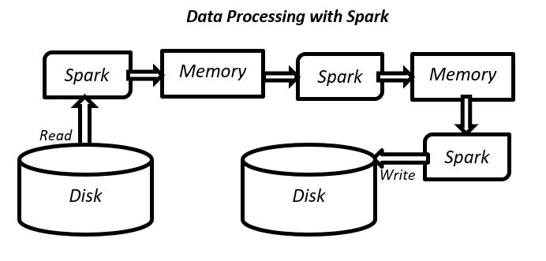
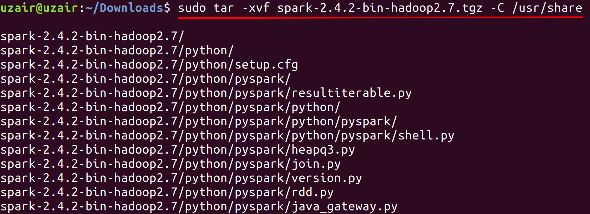
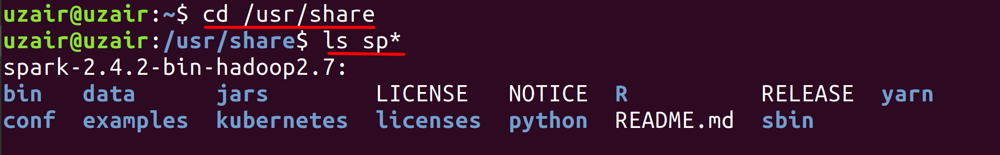
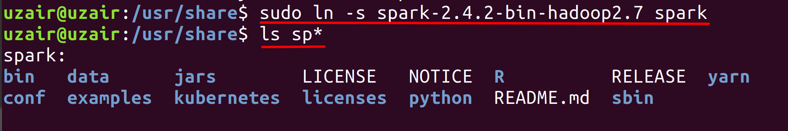
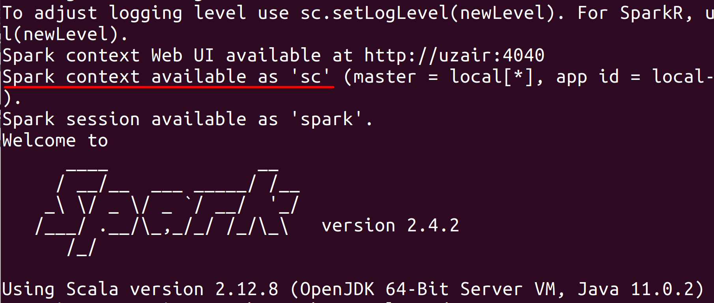

# Lab : Apache Spark Installation

#### Pre-reqs:
- Google Chrome (Recommended)


#### Data Processing with Spark

In Spark, the data is read from the disk, processed in-memory but instead of spilling it back to disk, Spark can retain the data within the memory for further processing. So, if the processed data is again required for further processing, the data is already present in the memory and the Spark application processes the data eliminating the IO latency and therefore the overall time to process the job is significantly reduced. 




## Install Spark...

**Step 1:** Verify the installation with: `java -version` 

You'll see the following output:

```
java version "1.8.0_201"
Java(TM) SE Runtime Environment (build 1.8.0_201-b09)
Java HotSpot(TM) 64-Bit Server VM (build 25.201-b09, mixed mode)
```

**Step 2:** Let us install Spark in Standalone mode. Navigate to the download URL below, select the latest stable version for Spark (which is Spark 2.4.2 at the time of writing this book) and select the package type which is Pre-built for Apache Hadoop 2.7 and later. After selecting click the link as shown in the screenshot below to download Spark.

Download URL : http://spark.apache.org/downloads.html

`wget https://www-us.apache.org/dist/spark/spark-2.4.5/spark-2.4.5-bin-hadoop2.7.tgz`

After running the above command, your download should start. The download may take a while depending upon your internet connection.

**Step 3:** The download will be saved in the current directory by default. You may optionally check if Spark has been downloaded using the ls command.

`ls` 

Now that you are sure that you have the Spark tar file, untar the Spark tar file to /usr/share directory using the command below.

`sudo tar -xvf spark-2.4.5-bin-hadoop2.7.tgz -C /usr/share` 
 


The file will start to untar to /usr/share directory as shown in the screenshot above. You can verify the same by executing the following command below.

`cd /usr/share`

`ls sp*`



As we can see from the screenshot above, the Spark directory is listed.


Let us make a softlink to the spark directory so that we don't have to refer Spark with entire name as above. This will also be useful for the future updates. Execute the following command.

`sudo ln -s spark-2.4.5-bin-hadoop2.7/ spark`



Run the following command again to check if we were able to create the softlink successfully.

`ls sp*`
 
 ## Environment Variables

**Step 4:** Let us now set up the environment variables for Spark. Execute the following command to do so.

Run following commands to append the environment variable at the end of the file.

`echo "SPARK_HOME=/usr/share/spark" >> ~/.bashrc`

`echo "PATH=$PATH:$SPARK_HOME/bin:$SPARK_HOME/sbin" >> ~/.bashrc`


Now reload the modified .bashrc file using the following command.

`source ~/.bashrc`

## Spark Shell


**Step 5:** Let us now test the Spark installation by accessing the Spark Shell. To do so, execute the following command.

`spark-shell`

Once you run, the above command, a screen similar to the screenshot shows confirming the successful installation of Spark.
 


**Note:** It might not work first time, Type `Ctrl` + `C` to quit and run `spark-shell` command again in that case.

Run `:q` to exit `spark-shell`.

Task is complete!

